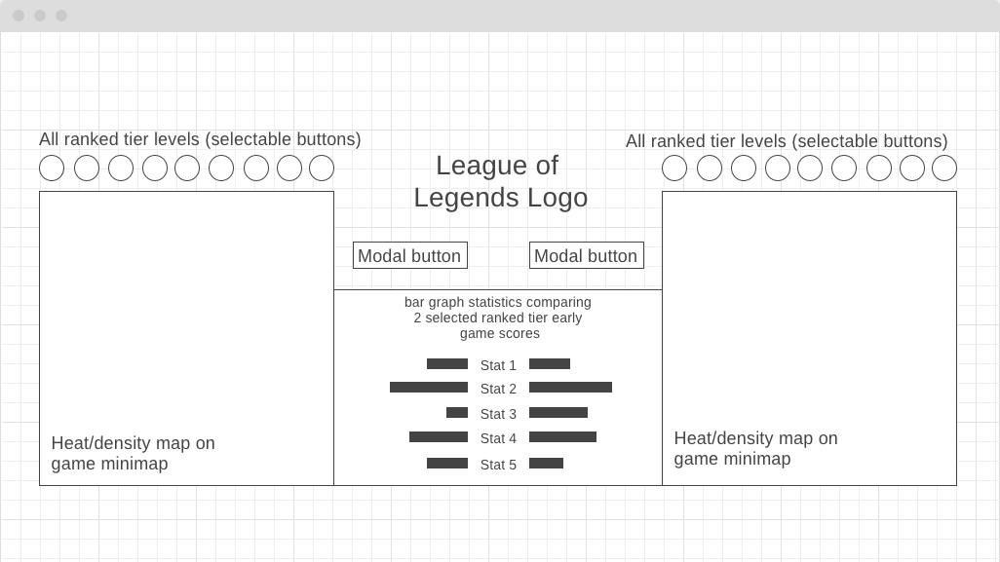

# League Ward Placement Data Visualization

## Background and Overview
  * Motivation for project
    * League of Legends is one of my favorite games to play; it's a fun, competitive game that requires skill, teamwork, and strategy to win. It also presents an excellent opportunity to analyze data from winning teams to observe how players of different levels of skill perform within the early stages of a game.
  * High level overview
    * Users will be able to review and observe patterns of player deaths in the first 15 minutes in a sample selection of matches ranging from the lowest tier of ranked play (iron tier) to the highest level tier (challenger tier). This mapping of data will hopefully show how locations and statistics differ from low-level play vs. high level play. The breakdown of average stats per game, such as total gold earned, wards placed, and towers destroy on the map will also be graphed to show the differences in numbers of how different level divisions perform within the early stages of the game. 

## Functionality and MVP Features
  * Users will be able to:
    * Switch between comarisons of all 9 rank tiers to see how the map data changes over different levels of competitive play
    * See a comparison of two heat/density maps of all player deaths on the game map by two different tier classes within the first 15 minutes of the match
    * See two sets of buttons available to toggle which league division's stats are being displayed
    * See a bar graph of average game statistics for that division (average towers destroyed, total gold, wards placed, lane minions killed, and jungle minions killed)

## Wireframes
  * The app will consist of two top-down maps of the game at the bottom with two separate line graphs (one for data on each tier). There will be a navbar above each map of all the league tiers to change the data being visualized in both the line graphs and game map. 

  

## Architecture and Technologies
  * This project will implement the following technologies:
    * Vanilla JavaScript for data management
    * Riot Games Developer API used for fetching relevant game data 
    * D3 JavaScript library to visualize the game data
    * Webpack to bundle up and present the various javascript files

## Implementation Timeline
  * Day 1:
    * Set up project skeleton (set up webpack, index files)
    * Learn how to pull data through Riot Games match data API
    * Go over how to map data via D3 tutorials
  * Day 2:
    * Shape JSON information to retrieve only data relevant to player death locations and relevant game stats
    * Learn how to utilize D3 library to map ward location data onto game map via a heat map or density map
  * Day 3:
    * Retrieve JSON information to create line graphs of relevant team data 
    * Extend line graph to include individual role vision contribution data
  * Day 4:
    * Split up data by ranked tiers
    * Stylize and improve visuals of graphs